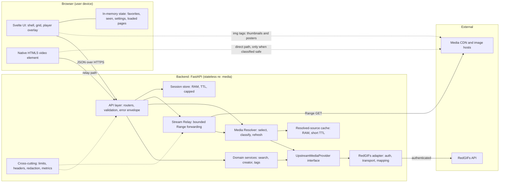
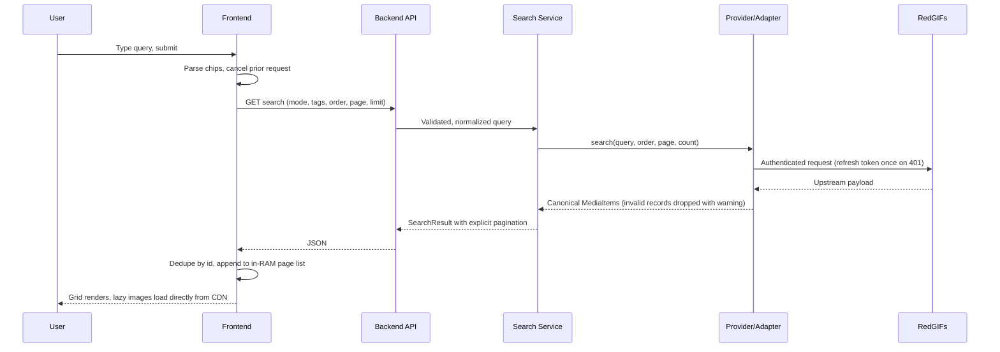
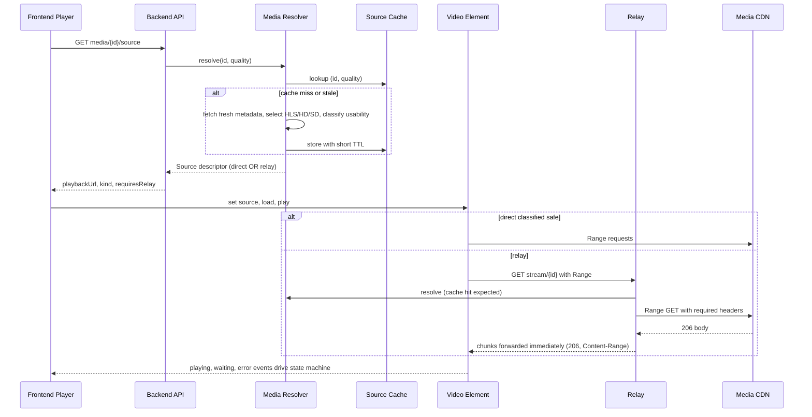
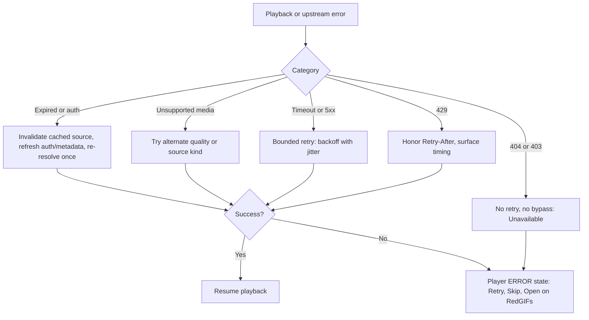
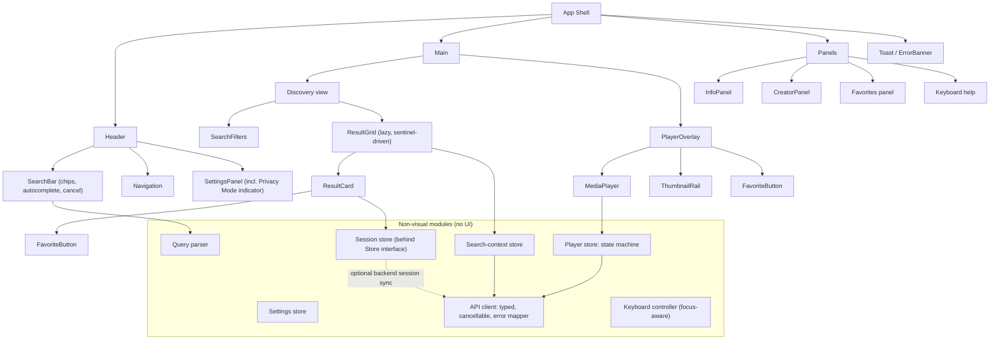
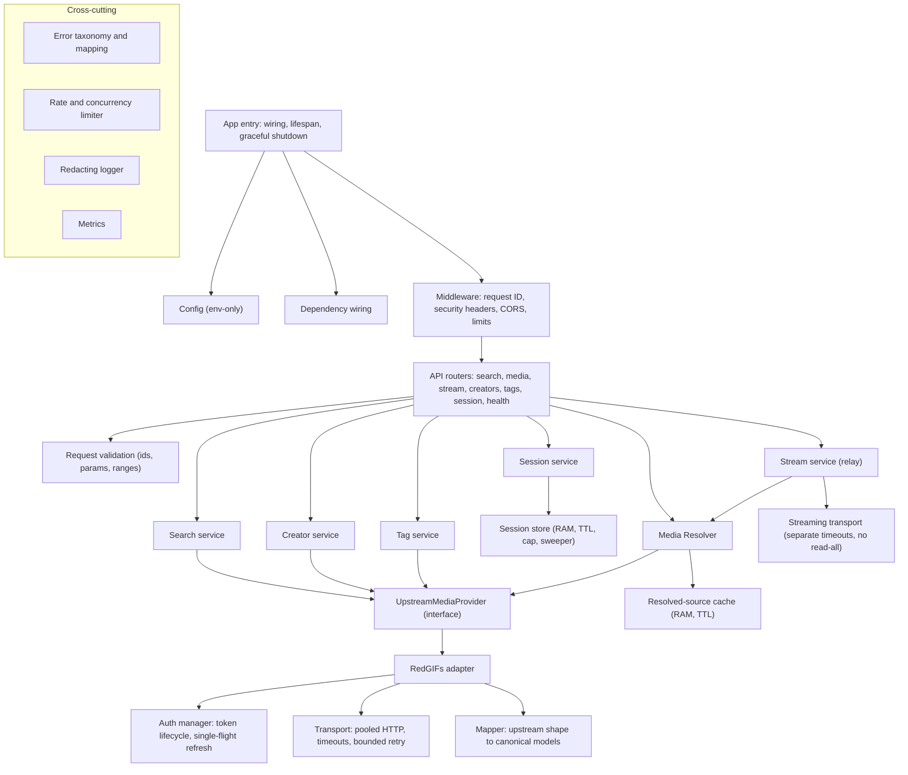
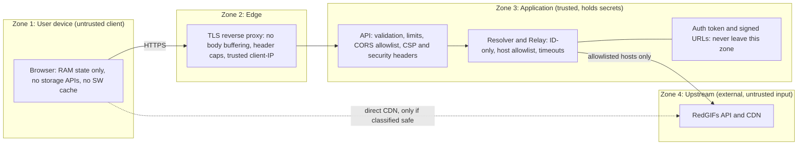
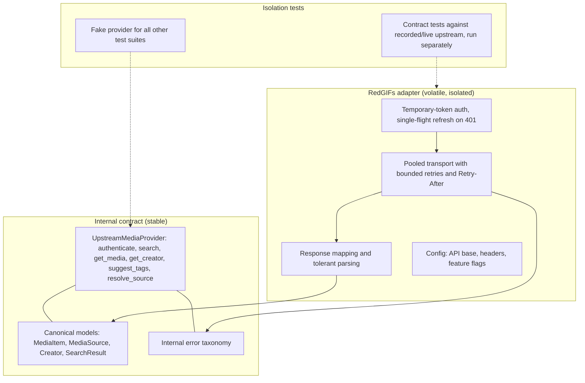
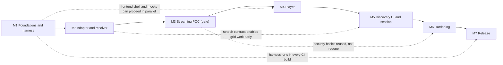

# Stream-First Media Browser: System Architecture & Implementation Roadmap

**Legend:** **[REQ]** = stated in the spec. **[INF]** = Architectural Inference (recommendation where the spec is silent or ambiguous). **[OPEN]** = Open Decision needing a product or engineering call.

---

## 1. Architecture Summary

A **stream-first web app** with four deliberately separated concerns **[REQ §70]**:

| Concern | Owner | Key rule |
|---|---|---|
| **Presentation** | Svelte/TS frontend | Never calls RedGIFs; browser engine owns playback state |
| **Discovery** | Search/Creator/Tag services | Normalize upstream into canonical `MediaItem` |
| **Media resolution** | Media Resolver | The single reliability boundary; returns a source *descriptor*, never bytes |
| **Delivery** | Direct URL or bounded Range relay | ID-only endpoint, no full-file buffering, no persistence |

Upstream volatility is confined to one adapter behind an internal provider interface **[REQ §11]**. All user state is RAM-only and TTL-bound **[REQ §26–27]**. There is no database, media cache, or thumbnail cache **[REQ §3]**.

**[INF] Core architectural stance:** treat the backend as a *stateless request translator* with three small in-RAM structures (upstream auth token, short-lived resolved-source cache, optional session store) and nothing else. Everything else is pass-through.

---

## 2. Requirements → Architecture Implications

| # | Requirement | Architectural implication | Type |
|---|---|---|---|
| 1 | No app-created media/thumbnail/DB/settings files (§3) | No filesystem dependency in the media path; logs to stdout; filesystem-write monitoring is a first-class test harness | REQ |
| 2 | Browser decodes media (§9, §22) | No decoder in the stack; player state is *derived from* `<video>` events, never authoritative | REQ |
| 3 | Direct first, relay fallback (§13) | Resolver must *classify* source usability; relay is a peer path, not an afterthought | REQ |
| 4 | Relay: bounded, Range-capable, ID-only (§14–16) | Streaming I/O with backpressure; disconnect propagation; no URL parameter anywhere | REQ |
| 5 | Credentials server-side only (§3, §5) | Auth lives wholly inside the adapter; token never crosses the API boundary or logs | REQ |
| 6 | Frontend independent of RedGIFs shapes (§66) | Canonical models are the only contract; adapter does all mapping | REQ |
| 7 | Ephemeral favorites/history/settings (§26) | Frontend store behind a `Store` interface so account mode can slot in later | REQ + INF |
| 8 | Session TTL 60 min idle / 24 h max (§27) | Periodic sweeper + max-session cap; no serialization | REQ |
| 9 | Source URLs are ephemeral (§52) | Resolve on demand; retry once on expiry; never persist | REQ |
| 10 | Prefetch metadata only (§24) | Navigation prefetch = metadata + optional resolution; no media bytes | REQ |
| 11 | Stable error taxonomy (§33) | One error envelope across all endpoints; frontend branches on category, not HTTP details | REQ |
| 12 | One failure must not break the grid (§19, §50) | Per-item error isolation in both normalization and UI | REQ |
| 13 | Scale by streams/bandwidth (§43) | Concurrency limits are the primary capacity control; proxy buffering disabled | REQ |
| 14 | Streaming POC gates UI work (§69) | Roadmap is POC-first; UI starts after the POC passes | REQ |
| 15 | Relay is hit on every Range request | Re-resolving each time would multiply upstream calls | INF |
| 16 | Per-IP limits only work with correct client-IP derivation | Trusted-proxy config required in deployment | INF |

---

## 3. High-Level System Architecture Map

**[INF]** Dotted lines are the paths that bypass the backend. They are the main privacy trade-off (see Open Decision O3).

---

## 4. Runtime Data Flow

### 4a. Search and browse

### 4b. Open and play an item

### 4c. Failure path **[REQ §33–34, §52]**

---

## 5. Frontend Component Tree

**[INF] Boundary rules:**

- Components never import the API client directly; they go through stores. Stores are the unit-test seam.
- The **player store owns the state machine**; `MediaPlayer` only translates `<video>` events into state transitions and back.
- The **query parser** is a pure module, so it is trivially testable and mirrored by a backend normalizer for authoritative behavior.
- `Store` is an interface with one implementation (RAM) in v1 **[REQ §28]**.

---

## 6. Backend Component Tree

**[INF] Boundary rules:**

- Only `RedGIFs adapter` and its children know upstream shapes, header quirks, or URL formats **[REQ §66]**.
- The **Resolver depends on the interface, not the adapter**, so a second provider is a new adapter, not a rewrite **[REQ §65]**.
- Streaming transport is **separate** from request/response transport, because it needs different timeouts and must never share a code path that can buffer a full body.
- The resolved-source cache exists because the relay is invoked per Range request. It holds descriptors only (RAM, short TTL, never logged, never persisted), which is consistent with the no-persistence rule.

---

## 7. Frontend/Backend API Boundary

**Contract principles [INF]:** JSON only except the stream endpoint; one error envelope (category, human message, correlation ID, optional retry-after); OpenAPI generated from the backend **[REQ §60]**; frontend types derived from, or checked against, that schema; no upstream field leaks.

| Endpoint | Purpose | Boundary notes |
|---|---|---|
| `GET /api/search` | Search/trending/creator results | Backend owns query normalization; explicit pagination; limit capped (≤100) |
| `GET /api/media/{id}` | Fresh metadata | Canonical `MediaItem` only |
| `GET /api/media/{id}/source` | Short-lived source descriptor | Returns a browser-safe playback URL; never upstream tokens |
| `GET /api/stream/{id}` | Range relay | ID-only; 200/206/416 semantics; no body buffering |
| `GET /api/creator/{username}` | Creator profile | Canonical `Creator` |
| `GET /api/tags/suggest?q=` | Autocomplete | Frontend debounces (200–300 ms, ≥2 chars) **[REQ §30]** |
| `GET /api/session`, `GET /api/session/state`, `POST/DELETE /api/session/favorites/{id}`, `POST /api/session/seen/{id}` | Optional ephemeral server-side state | `no-store`; see O1 on whether v1 needs these |
| `GET /health/live`, `/health/ready` | Ops | Readiness excludes live upstream calls **[REQ §63]** |

**Spec inconsistencies the boundary must resolve (see O5):**

- `MediaSource` is defined with a `url` field in §10 but returned as `playbackUrl` in §68. **[INF]** Use `playbackUrl`. A relay-bound descriptor should only ever carry the internal relay path.
- §67 has the stream endpoint *redirecting* when no relay is needed, while §13 and §53 have `/source` return the direct URL. **[INF]** Make `/source` the only place the direct-vs-relay decision is communicated, and keep `/api/stream/{id}` relay-only. A redirect from the relay endpoint blurs the contract.
- **[INF]** The `quality` preference (`auto|hd|sd`) needs a defined carrier. Put it on `/source` and make the choice deterministic in the resolver, so later relay Range requests resolve to the same variant.

---

## 8. State Ownership Map

| State | Owner | Lifetime | Persistence | Type |
|---|---|---|---|---|
| Playback position, buffering, volume actual | Browser media engine (`<video>`) | Element lifetime | None | REQ |
| Player state machine | Frontend player store (derived from video events) | Open item | None | REQ |
| Loaded result pages, search context, scroll position | Frontend search-context store | Until context discarded | RAM | REQ |
| Favorites, seen, search history, saved searches | Frontend session store (v1 authoritative) | Tab lifetime | RAM only | INF (spec permits either side) |
| Playback/UI settings | Frontend settings store | Tab lifetime | RAM only | REQ |
| Anonymous server session (if used) | Backend session store | 60 min idle / 24 h max | RAM only, capped | REQ |
| Upstream auth token | Backend auth manager | Until expiry/401 | RAM only | REQ |
| Resolved source descriptors | Backend resolver cache | Seconds to minutes | RAM only | INF |
| Source URLs / signatures | Resolver only | Ephemeral | Never persisted, never logged | REQ |
| Persistent favorites/settings | Future account service | n/a in v1 | Opt-in only | REQ (future) |

**[INF] Single-owner rule:** each datum has exactly one authoritative owner. In particular, favorites must not be dual-written with two sources of truth. If a backend session mirrors them, it is a replica, and the frontend wins on conflict.

---

## 9. Security & Privacy Boundaries

| Boundary | Control | Type |
|---|---|---|
| SSRF / open relay | ID-only endpoint; upstream URL resolved server-side; post-resolution host allowlist; reject private/loopback/link-local targets and non-HTTPS schemes | REQ |
| Token leakage | Token confined to Zone 3; redacted logging (no bearer, cookies, signed URLs, session contents, full query history) | REQ |
| Bandwidth/memory abuse | Per-IP and per-session stream caps; bounded chunk reads; connect/header/idle/total timeouts; abort upstream on disconnect | REQ |
| Session exhaustion | TTL + absolute lifetime + max-session cap + sweeper | REQ |
| Malformed upstream | Strict parsing, size/header limits, per-item drop with warning | REQ |
| XSS / clickjacking / CORS | No unsafe HTML for metadata; CSP + frame-ancestors none; same-origin preferred, explicit allowlist otherwise | REQ |
| Client-side persistence | No localStorage, IndexedDB, Cache Storage, or service worker; cookies avoided in anonymous mode | REQ |
| Privacy claim wording | "Does not *intentionally* persist media or application data locally" and no stronger | REQ |
| Client-IP trust | Only honor forwarded-IP headers from the configured proxy | INF |
| Relay re-resolution per Range | Cache descriptor in RAM to bound upstream amplification | INF |
| CSP tuning | Narrow `media-src`/`img-src` to what the chosen direct/HLS strategy needs rather than blanket `https:` | INF (spec says tune) |
| Privacy exposure of direct paths | Thumbnails and any direct media expose the user's IP and referrer to third-party hosts; no-referrer mitigates only part | OPEN (O3) |

---

## 10. External Integration Architecture

- **Replaceability [REQ §11, §65]:** whether the adapter wraps the third-party library or a thin first-party HTTP client is an adapter-internal choice. **[INF]** Start with whichever is faster to contract-test, and don't let either type leak past the mapper.
- **Failure isolation [REQ §63]:** upstream health is reported separately from process readiness.
- **Kill switches [REQ §44, §64]:** `ENABLE_DIRECT_MEDIA` and `ENABLE_HLS` flags let ops force relay-only or MP4-only without a deploy.
- **Upstream change playbook [REQ §64]:** URL or format changes should be fixed only in the adapter/resolver plus contract tests.
- **Compliance gate [REQ §5]:** verify upstream terms, rate limits, and permitted use before production. The system must fail safely on 403s and must not bypass access controls **[REQ §33]**.
- **Image hosts [INF]:** thumbnails are a second external dependency, but a simple one. The frontend uses the URLs as-is with no backend involvement **[REQ §29]**.

---

## 11. Development Milestones (7)

Consolidated from the spec's M0–M8. **[INF]** Security basics are pulled forward into the relay milestone because a "POC" relay without ID-only access, an allowlist, and timeouts would be unsafe to even demo.

| # | Milestone | Scope | Exit gate | Spec map |
|---|---|---|---|---|
| **M1** | **Foundations & test harness** | Repo, CI, backend/frontend shells, config, error envelope, canonical models, provider interface with fake provider, OpenAPI generation, **filesystem-write monitoring harness** | Builds and tests green; harness runs on an empty app and reports zero writes | M0 |
| **M2** | **Upstream adapter & resolver** | Auth lifecycle, search/media/creator/tags, normalization, source selection and classification, source cache, error mapping | Contract tests pass; stable errors for 401/404/429/timeouts | M1 |
| **M3** | **Streaming POC (gating)** | Direct-vs-relay decision, relay with Range/206/416, disconnect cleanup, ID-only/allowlist/timeouts/concurrency caps, bare test page with native `<video>` | Play, pause, seek, retry, next work; zero media files; relay memory flat across a large object | M2 + early M6 |
| **M4** | **Player** | Player store/state machine, controls, keyboard map, retry/skip/open, quality fallback | Playback E2E passes incl. failure recovery | M3 |
| **M5** | **Discovery UI & session features** | Search UX/chips/autocomplete, grid, infinite scroll, cancellation, overlay navigation, favorites/seen/random/history in RAM, settings, Privacy Mode indicator, a11y | Browsing + keyboard + responsive E2E pass; no-persistent-storage test passes | M4 + M5 |
| **M6** | **Hardening** | Rate limits, CORS/CSP/headers finalization, log redaction audit, session caps, threat-model review, load tests, tuned stream limits | Security suite passes; targets met or documented | M6 + M7 |
| **M7** | **Release** | Container/proxy config, health/metrics, runbook, docs with accurate privacy wording, full no-download compliance run | Production checklist and release-blocking privacy tests pass | M8 |

---

## 12. Milestone Dependency Graph

Solid arrows are hard dependencies. Dotted arrows are permitted parallelism or reuse. **[REQ §69]** No full UI work starts before M3 passes.

---

## 13. Architecture Decision Summary

| # | Decision | Rationale | Type |
|---|---|---|---|
| D1 | Browser-native playback; no custom decoder | Hardware decoding, seeking, audio, buffering for free | REQ |
| D2 | Backend adapter owns all upstream concerns | Isolates volatility; keeps tokens off the client | REQ |
| D3 | Provider interface between services and adapter | Replaceability and testability | REQ |
| D4 | Resolver is the reliability boundary; relay is a first-class fallback | Upstream URLs are not reliably browser-playable | REQ |
| D5 | ID-only, Range-capable, bounded relay; no generic proxy | Eliminates SSRF/open-relay class | REQ |
| D6 | RAM-only state; no DB in v1 | Privacy model; simpler infrastructure | REQ |
| D7 | `Store` interface on the frontend | Account mode later without rewrite | REQ |
| D8 | Frontend is authoritative for favorites/seen/history in v1 | One owner; fewer moving parts; avoids server session affinity | INF |
| D9 | Short-TTL RAM source cache in the resolver | Avoids re-resolving on each Range request | INF |
| D10 | `/source` is the only place direct-vs-relay is communicated; stream endpoint is relay-only | Clean contract; removes redirect ambiguity | INF |
| D11 | MP4-first; HLS behind a flag and not required for v1 | Relay is ID-based and Range-based, so HLS would need playlist and segment handling that the spec doesn't define | INF |
| D12 | Same-origin deployment by default | Simplifies CORS, CSP, cookie-free model | REQ (preferred) |
| D13 | Concurrency caps as primary capacity control | Streams and bandwidth, not request rate, are the scarce resource | REQ |
| D14 | Pull basic relay security into the POC milestone | Avoid shipping an unsafe prototype | INF |
| D15 | Single process or session-sticky routing if backend sessions are kept | In-RAM session store is per-process | INF |

---

## 14. Open Architectural Questions

| # | Question | Recommended default |
|---|---|---|
| **O1** | Does v1 need backend sessions at all? The spec lists session endpoints, but also says frontend state is in-memory and cookies are preferably absent. | **[INF]** Frontend-only for favorites/seen/history. Keep session endpoints as a later, thin addition. If kept, the session identifier must live in JS memory (lost on reload), which fits the privacy model but should be a conscious decision. |
| **O2** | If backend sessions are used with multiple workers, how is the in-RAM store kept consistent? | Single worker or sticky routing, or defer per O1. |
| **O3** | Direct playback and direct thumbnails expose user IP and referrer to third-party hosts, and signed CDN URLs reach the browser. Is that acceptable for the privacy positioning? Does the CDN enforce hotlink or header checks that make direct playback unreliable in practice? | **[INF]** Implement a conservative classifier; expect relay to be the common path until `direct_vs_relay_ratio` data says otherwise. Decide image proxying only if privacy requirements tighten (it would add a bandwidth path the spec currently excludes). |
| **O4** | Should HLS be in v1? The spec's relay has no playlist/segment story. | Defer; MP4 only. Flag stays in config. |
| **O5** | Resolve spec inconsistencies: `url` vs `playbackUrl`; stream endpoint redirect vs relay-only; quality carrier; "approved direct URL" definition. | Per §7 above. |
| **O6** | Upstream terms, rate limits, and permitted use for the intended deployment (hosted especially). | Gate any hosted or public release on this review. |
| **O7** | Who is allowed to use a hosted relay? The spec has per-IP limits but no access control, so an internet-facing relay is an open bandwidth resource. | Private/trusted-network mode first; define access control before any public hosting. |
| **O8** | Audience gating (age or legal) for hosted mode is unspecified. | Out of scope for the architecture; needs a product/legal call before hosted release. |
| **O9** | Deep-linkable URLs for search or player state vs. privacy (browser history is the browser's, not the app's). | Keep URL state minimal; document the distinction. |
| **O10** | What does Privacy Mode OFF mean in v1, given there is no opt-in persistence yet? | **[INF]** Show Privacy Mode as a locked-ON indicator until a persistence feature exists. |
| **O11** | Source-cache TTL, session cap, and eviction policy values. | Set from M6 load testing, not guessed. |
| **O12** | Browser support matrix (native HLS, Fullscreen API, mobile autoplay policies). | Define before M4 E2E tests. |
| **O13** | Where do metrics/logs go in local mode if zero persistence is desired? | stdout only; metrics endpoint optional. |

---

## 15. Recommended Implementation Order

1. **Repo, CI, shells, config, error envelope, canonical models, OpenAPI** (M1).
2. **Filesystem-write monitoring harness**, wired into CI from day one, so the no-download guarantee is tested continuously rather than at the end (M1) **[INF]**.
3. **Provider interface + fake provider**, so every downstream suite can run without upstream (M1).
4. **Adapter: auth lifecycle, media lookup, source classification** with contract tests (M2).
5. **Search, creator, tags** through the adapter, with normalization and per-item error tolerance (M2).
6. **Resolver with source cache** and the internal error taxonomy (M2).
7. **Relay: Range forwarding, bounded reads, disconnect cleanup, ID-only/allowlist/timeouts/concurrency caps** (M3).
8. **Bare test page with native `<video>`**: prove play, pause, seek, retry, next, zero media files, flat memory. **Do not proceed until this passes** (M3) **[REQ §69]**.
9. **Player store/state machine, controls, keyboard map, failure UX** (M4).
10. **Search UX, chips, autocomplete, grid, infinite scroll, cancellation** (M5).
11. **Overlay navigation, thumbnail rail, info/creator panels** (M5).
12. **Session features in RAM: favorites, seen, random, history, settings, Privacy Mode indicator; accessibility pass** (M5).
13. **Rate limits, CORS/CSP finalization, redaction audit, load testing, tuned stream limits, threat-model review** (M6).
14. **Deployment config, health/metrics, runbook, docs with precise privacy wording; full no-download compliance run** (M7).

**Before step 7:** settle O3, O4, and O5. They change the relay and resolver contracts.
**Before any hosted release:** settle O6, O7, and O8.