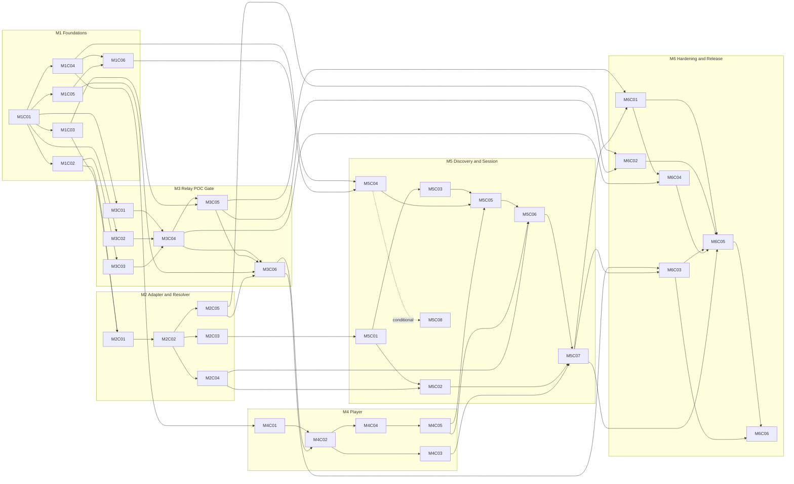

# Incremental Implementation Manifest: Stream-First Media Browser

**Sources of truth**
- **REQUIREMENTS** = `REQUIREMENTS.md` (cited as `§n`).
- **ARCHITECTURE** = `ARCHITECTURE.md` (cited as `D#` decisions, `O#` open questions, `M#` architecture milestones).

**Conventions**
- **(INF)** marks an Architectural Inference. It is a recommendation where the sources are silent and needs sign-off if it changes behavior.
- File paths follow the spec's repository layout (§7). Paths marked **(+)** are additions the layout does not list.
- No chunk contains implementation code. "Interfaces" means contracts: names, shapes, and behaviors.
- Test fixtures committed to the repo (e.g. a small sample video for browser E2E) are source-controlled assets, not application-created files. The compliance harness monitors runtime locations only.

---

## 1. Milestone Overview (6 milestones)

The architecture's 7 milestones are consolidated to 6 by merging Hardening and Release. Security basics are already delivered in M3, so M6 is finalization, proof, and packaging.

| # | Milestone | Goal | Exit gate |
|---|---|---|---|
| **M1** | Foundations & Compliance Harness | Runnable skeleton, canonical contracts, safe logging, continuous no-persistence verification | CI green; harness catches a deliberate violation and reports zero writes on an idle app |
| **M2** | Upstream Adapter & Media Resolution | All upstream behavior behind one provider interface; search/creator/tags/media/source endpoints | Contract tests pass (recorded; live on demand); stable error categories for 401/404/429/timeouts |
| **M3** | Streaming Relay (POC Gate) | ID-only, bounded, Range-capable relay with security guardrails and a bare native-`<video>` proof | Play/pause/seek/retry/next work; zero media files; flat relay memory; upstream closes on cancel |
| **M4** | Player | State machine, native player component, recovery, controls, keyboard, overlay navigation | Playback E2E passes including injected failures |
| **M5** | Discovery UI & Session Features | Search UX, grid, infinite scroll, in-RAM favorites/seen/history/settings, app integration, a11y | Browsing, keyboard, and responsive E2E pass; no-persistent-storage test passes |
| **M6** | Hardening & Release | Headers/CORS/CSP, log-leak audit, load tuning, deployment, full compliance run, docs/runbook | Security suite, performance targets, and release-blocking privacy tests pass |

---

## 2. Decision Gates (resolve before the named chunk starts)

| Gate | Question | Blocks | Default if unresolved |
|---|---|---|---|
| **O5** | Descriptor field naming (`playbackUrl`), stream endpoint is relay-only, quality carried on `/source` | M1-C01 | Adopt architecture defaults (D10) |
| **O6** | Upstream terms, rate limits, permitted use | Live-mode use in M2-C02; M3-C06 live smoke; any hosted release | Recorded fixtures only until reviewed |
| **O3 / O4** | Direct-vs-relay privacy trade-off; HLS in v1 | M2-C05, M3-C04 | Conservative classifier; MP4 only (D11) |
| **O1 / O10** | Backend sessions in v1? Privacy Mode behavior | M5-C04, M5-C08 | Frontend-only state; Privacy Mode locked ON |
| **O12** | Browser support matrix | M4-C02 E2E | Latest evergreen desktop + mobile browsers |
| **(INF) G1** | No local rate-limit category exists in the §33 taxonomy | M3-C05 | Resolved in M3-C05: add `LOCAL_RATE_LIMITED` with HTTP 429 |
| **(INF) G2** | Multi-range `Range` header behavior (spec only requires single ranges) | M3-C02 | Treat as unsupported and answer as if no Range was sent |
| **(INF) G3** | Definition of "seen" | M5-C05 | Mark seen when playback begins |
| **OPEN G4** | `browser_player_errors` metric (§37) needs a reporting path the API list does not define | M6-C02 | Not implemented; count locally in RAM only |
| **O11 / O13** | Cache/session/limit values; metrics exposure in local mode | M6-C02, M6-C03 | Values from load tests; stdout-only |
| **O7 / O8** | Access control and audience gating for hosted mode | Hosted release (outside this manifest) | Private/trusted-network deployment only |

---

## 3. Milestones and Chunks

---

# M1: Foundations & Compliance Harness

### M1-C01: Backend core, error envelope, canonical models, health
- **Milestone:** M1
- **Purpose:** Establish the service skeleton and the contracts every later chunk depends on.
- **Files to create:** `backend/app/main.py`, `config.py`, `dependencies.py`, `domain/models.py`, `domain/errors.py`, `domain/enums.py`, `api/health.py` (+), backend project/dependency manifest (+), `backend/tests/unit/test_config.py`, `test_models.py`, `test_errors.py`, `backend/tests/integration/test_health.py`
- **Files to modify:** None
- **Dependencies:** None (gate O5)
- **Interfaces/API contracts introduced:**
  - Environment-only configuration with the §44 keys, validated at startup.
  - One error envelope: category, human message, correlation ID, optional retry-after. Categories are exactly the §33 taxonomy.
  - Canonical models: `MediaItem`, `MediaSource` (with `playbackUrl`), `Creator`, `SearchResult`, `SearchQuery`.
  - `GET /health/live` and `GET /health/ready`. Readiness makes no upstream call (§63).
  - Generated OpenAPI document.
- **Tests required:** config validation (missing/invalid values fail fast); model nullability matches §10; every error category maps to an HTTP status and envelope; health endpoints.
- **Acceptance criteria:** App boots from environment alone. OpenAPI includes all canonical models. No filesystem writes at startup.
- **Out of scope:** Upstream calls, sessions, rate limits, any non-health endpoint.

### M1-C02: Provider interface, internal source target, fake provider
- **Milestone:** M1
- **Purpose:** Fix the replaceable upstream seam (D3) so every later suite can run without the real upstream.
- **Files to create:** `backend/app/upstream/provider.py`, `backend/tests/fakes/fake_provider.py` (+), `backend/tests/contract/provider_contract.py` (+, reusable suite), `backend/tests/unit/test_fake_provider.py`
- **Files to modify:** `domain/models.py` (add internal-only source target), `dependencies.py` (provider injection)
- **Dependencies:** M1-C01
- **Interfaces/API contracts introduced:**
  - `UpstreamMediaProvider` with the six operations in §11.
  - Resolver interface: resolve(id, quality) returns a public descriptor plus an internal source target.
  - The internal source target (upstream URL plus required headers) is never part of any API model.
  - Fake provider with fault injection: not-found, rate-limited, auth-expired, malformed item.
- **Tests required:** the shared provider contract suite passes against the fake; a test proves the internal source target cannot be serialized into any response model.
- **Acceptance criteria:** Services can be constructed with the fake provider alone. The contract suite is importable by the real adapter in M2.
- **Out of scope:** Real adapter, resolver logic, HTTP endpoints.

### M1-C03: Request context, redacting logging, metrics registry
- **Milestone:** M1
- **Purpose:** Make logging safe before anything that handles tokens or signed URLs exists.
- **Files to create:** `observability/logging.py`, `observability/metrics.py`, `backend/tests/unit/test_logging_redaction.py`, `backend/tests/integration/test_request_context.py`
- **Files to modify:** `main.py` (request-ID middleware)
- **Dependencies:** M1-C01
- **Interfaces/API contracts introduced:**
  - Correlation ID generated per request and echoed in the error envelope.
  - Structured log fields per §36 (operation, media ID only when needed, status category, duration, correlation ID).
  - Redaction rules: bearer tokens, authorization headers, cookies, signed-URL query strings, session contents.
  - In-process metrics registry with the §37 metric names pre-declared.
- **Tests required:** redaction of each secret class (including URLs with signatures); correlation ID appears in logs and error responses; logs go to stdout only.
- **Acceptance criteria:** No test scenario can emit a canary secret into logs.
- **Out of scope:** Metrics exposure mechanism (M6-C02), dashboards, frontend telemetry.

### M1-C04: Frontend foundation: typed API client and error mapper
- **Milestone:** M1
- **Purpose:** Give the UI a single, cancellable, schema-checked path to the backend.
- **Files to create:** Svelte/Vite/TypeScript project config, `frontend/src/App.svelte` (placeholder shell), `src/services/apiClient.ts`, `src/services/errors.ts`, `src/types/` (types derived from or checked against OpenAPI), schema-drift check script (+), `frontend/tests/unit/` client tests
- **Files to modify:** None
- **Dependencies:** M1-C01
- **Interfaces/API contracts introduced:**
  - Typed client with per-request cancellation.
  - Backend error envelope mapped to frontend error categories.
  - Schema-drift check comparing frontend types to backend OpenAPI.
- **Tests required:** cancellation behavior; error mapping per category; malformed-response handling; schema-drift check fails on a deliberately mutated model.
- **Acceptance criteria:** Production build succeeds; type check passes; client contains no upstream URLs or RedGIFs knowledge.
- **Out of scope:** Stores, components beyond the shell, any storage APIs.

### M1-C05: No-persistence compliance harness
- **Milestone:** M1
- **Purpose:** Make the product's core guarantee testable from day one (§47).
- **Files to create:** `tools/compliance/fs_monitor/` (+), `tools/compliance/browser_storage_check/` (+), `tests/compliance/test_harness_selfcheck` (+)
- **Files to modify:** None
- **Dependencies:** M1-C01
- **Interfaces/API contracts introduced:**
  - Scenario contract: start recording, run scenario, stop, report writes (path, type); non-zero exit on violation.
  - Detected violations: media extensions, database/settings files, and browser localStorage/sessionStorage/IndexedDB/Cache Storage/service-worker registrations.
  - Monitors runtime locations (app data, temp, server filesystem), excluding committed fixtures.
- **Tests required:** self-check proves detection of a deliberately created media file, database file, and settings file; passes on an idle app boot; browser check detects a deliberately registered service worker.
- **Acceptance criteria:** Harness is runnable locally and in CI with a clear pass/fail report. Writes are monitored during a scenario, not only inspected afterward (§47).
- **Out of scope:** The full 100-item scenario (M6-C05), playback tests.

### M1-C06: CI pipeline, lockfiles, dependency scanning, storage-API lint
- **Milestone:** M1
- **Purpose:** Enforce build discipline and the storage ban automatically.
- **Files to create:** CI pipeline definition (+), frontend lint rule banning browser storage APIs (+), lockfiles for backend and frontend, dependency vulnerability-scan step
- **Files to modify:** None
- **Dependencies:** M1-C04, M1-C05
- **Interfaces/API contracts introduced:** CI stages: backend unit, frontend unit/type-check, schema-drift check, harness idle-boot check, lint, dependency scan.
- **Tests required:** lint rule triggers on a banned-API fixture; schema-drift stage fails on mutated types; CI fails when a lockfile is out of date.
- **Acceptance criteria:** A clean checkout builds and passes all stages. Dependencies are pinned (§45).
- **Out of scope:** Deployment pipelines, browser E2E stage (added in M4-C02).

---

# M2: Upstream Adapter & Media Resolution

### M2-C01: Upstream auth manager and transport
- **Milestone:** M2
- **Purpose:** Centralize upstream authentication and resilient request behavior.
- **Files to create:** `upstream/auth.py`, `upstream/transport.py`, `backend/tests/unit/test_auth_manager.py`, `test_transport.py`, `test_error_classification.py`
- **Files to modify:** `domain/errors.py` (upstream-status to category classification)
- **Dependencies:** M1-C02, M1-C03
- **Interfaces/API contracts introduced:**
  - Auth manager: token acquisition and single-flight refresh. Refresh once on 401.
  - Pooled async transport with connect/read timeouts.
  - Bounded retries with exponential backoff and jitter (§34 schedule). `Retry-After` honored. No retry on 400/404/416 or deliberate denials.
  - Classification of upstream outcomes into §33 categories.
- **Tests required:** 401 → refresh → success; concurrent callers share one refresh; 429 with `Retry-After`; timeouts; non-retryable codes; tokens never appear in exception text or logs.
- **Acceptance criteria:** All upstream failure modes map to stable categories. Token stays inside this module.
- **Out of scope:** Endpoint parsing, mapping, search, streaming transport.
- **Risk:** Upstream auth assumptions (§5) are unverified. See Section 5.

### M2-C02: RedGIFs adapter: media lookup, mapper, contract harness
- **Milestone:** M2
- **Purpose:** Prove the adapter boundary end to end with the simplest operation and establish the contract-test discipline.
- **Files to create:** `upstream/redgifs_client.py`, `upstream/mapper.py` (+), `api/media.py` (`GET /api/media/{id}`), `security/validation.py` (media-ID validator), recorded upstream fixtures (+), `backend/tests/contract/test_redgifs_media.py` (recorded mode; opt-in live mode), `backend/tests/unit/test_mapper.py`
- **Files to modify:** `dependencies.py` (select real vs fake provider via config)
- **Dependencies:** M2-C01
- **Interfaces/API contracts introduced:**
  - `GET /api/media/{id}` returning canonical `MediaItem`.
  - Tolerant mapper: malformed or missing fields yield nulls or a dropped record with a warning, never an exception.
  - Media-ID validation rule shared by all ID-bearing endpoints.
  - Unimplemented provider operations raise an explicit "not implemented" error until M2-C03/C04.
- **Tests required:** provider contract suite against the adapter (recorded mode); mapper cases (missing/extra/malformed fields); 404 → not-found category; test that no raw upstream fields or tokens reach responses.
- **Acceptance criteria:** Canonical output only. Upstream response shapes are referenced nowhere outside `upstream/`.
- **Out of scope:** Search, creator, tags, source resolution, relay.
- **Risk:** First contact with real upstream shapes. See Section 5.

### M2-C03: Search: normalization, service, endpoint
- **Milestone:** M2
- **Purpose:** Deliver the discovery API with product-faithful query semantics (§18–19).
- **Files to create:** `services/search_service.py`, `api/search.py`, query-normalization module (+), `shared/fixtures/query_vectors.json` (+, reused by the frontend parser), `backend/tests/unit/test_query_normalization.py`, `backend/tests/integration/test_search_api.py`
- **Files to modify:** `upstream/redgifs_client.py`, `upstream/mapper.py`, `security/validation.py` (page/limit validation)
- **Dependencies:** M2-C02
- **Interfaces/API contracts introduced:**
  - `GET /api/search` with `creator`, `tags`, `mode`, `order`, `page`, `limit` returning `SearchResult` with explicit pagination.
  - Normalization of `@name`, `user:name`, `creator:name`, `#tag`, and comma-separated tags. Empty input becomes trending.
  - Page positive; limit 1..100.
- **Tests required:** shared normalization vectors; invalid page/limit rejected; a malformed item is omitted without failing the page; upstream errors mapped; order values pass through correctly.
- **Acceptance criteria:** No unbounded server-side pagination. Result items are canonical `MediaItem`s.
- **Out of scope:** Frontend parser, autocomplete, creator profiles.

### M2-C04: Creator profile and tag suggestions
- **Milestone:** M2
- **Purpose:** Complete the discovery API surface.
- **Files to create:** `services/creator_service.py`, `services/tag_service.py`, `api/creators.py`, `api/tags.py`, `backend/tests/integration/test_creator_api.py`, `test_tags_api.py`
- **Files to modify:** `upstream/redgifs_client.py`, `upstream/mapper.py`
- **Dependencies:** M2-C02
- **Interfaces/API contracts introduced:** `GET /api/creator/{username}` returning `Creator`; `GET /api/tags/suggest?q=` returning suggestions. Input length bounds on username and prefix (INF).
- **Tests required:** success, not-found, invalid input, upstream error mapping, provider contract suite extended.
- **Acceptance criteria:** Canonical `Creator` output only.
- **Out of scope:** Debounce, minimum-character UX, UI.

### M2-C05: Media Resolver and source descriptor endpoint
- **Milestone:** M2
- **Purpose:** Build the central reliability boundary (§12–13, §52–53).
- **Files to create:** `services/media_resolver.py`, source-cache module (+), `backend/tests/unit/test_source_selection.py`, `test_source_classification.py`, `test_source_cache.py`, `backend/tests/integration/test_source_endpoint.py`
- **Files to modify:** `api/media.py` (add `GET /api/media/{id}/source`), `upstream/redgifs_client.py` (`resolve_source`)
- **Dependencies:** M2-C02
- **Interfaces/API contracts introduced:**
  - `GET /api/media/{id}/source` returning kind, `playbackUrl`, `expiresAt`, `requiresRelay`. `quality` parameter `auto|hd|sd`, resolved deterministically.
  - Selection order: HLS only if enabled and suitable, else HD MP4, else SD MP4 (O4 default: MP4-only in v1).
  - Usability classification: direct only if no privileged headers are needed and direct media is enabled. Otherwise `playbackUrl` is the relay path.
  - Short-TTL RAM descriptor cache. On expiry: refresh and retry once.
  - Honors `ENABLE_DIRECT_MEDIA` and `ENABLE_HLS`.
- **Tests required:** selection matrix; classification matrix (header requirement × flags); cache TTL and invalidation; refresh-once; public descriptor never contains tokens, signed internals, or required headers; `direct_vs_relay_ratio` recorded.
- **Acceptance criteria:** Resolver never downloads media. Same ID and quality resolves to the same variant across calls.
- **Out of scope:** The relay itself, HLS playback, transcoding.
- **Risk:** Classifier correctness depends on real upstream behavior (O3). See Section 5.

---

# M3: Streaming Relay (POC Gate)

### M3-C01: Relay security guardrails
- **Milestone:** M3
- **Purpose:** Make the relay safe before it can be demonstrated (D14).
- **Files to create:** `backend/tests/unit/test_upstream_target_validation.py`
- **Files to modify:** `security/validation.py`, `config.py` (upstream host allowlist setting (+, INF))
- **Dependencies:** M1-C01
- **Interfaces/API contracts introduced:** `validate upstream target` rule: HTTPS only; host on allowlist; reject localhost, private ranges, link-local, loopback (IPv4 and IPv6) on the final connect target; redirects not followed by default (INF).
- **Tests required:** table-driven allowlist hits/misses; each private/loopback/link-local range; scheme rejection; hostnames that resolve to private addresses are rejected.
- **Acceptance criteria:** No code path can reach a non-allowlisted or private target.
- **Out of scope:** Relay streaming, rate limits.

### M3-C02: Range parsing and response semantics
- **Milestone:** M3
- **Purpose:** Isolate the Range/206/416 rules as pure, exhaustively testable logic (§15).
- **Files to create:** `services/range_semantics.py` (+), `backend/tests/unit/test_range_semantics.py`
- **Files to modify:** None
- **Dependencies:** M1-C01 (gate G2)
- **Interfaces/API contracts introduced:** Pure mapping from (client `Range`, upstream status/headers) to (downstream status, headers). Preserves or synthesizes `Content-Type`, `Content-Length`, `Content-Range`, `Accept-Ranges`, `ETag`, `Last-Modified`, cache-control per §14. Returns 416 when the range is invalid and size is known.
- **Tests required:** no Range, closed, open-ended, suffix, invalid, multi-range, upstream ignoring Range, unknown size, 416 cases.
- **Acceptance criteria:** Every §15 bullet is covered by a named test.
- **Out of scope:** Network I/O, endpoint wiring.

### M3-C03: Fake upstream CDN with fault injection
- **Milestone:** M3
- **Purpose:** Provide the test infrastructure for the relay, POC gate, and all later E2E.
- **Files to create:** `backend/tests/fixtures/fake_cdn.py` (+), small valid sample video as a committed fixture (+), `backend/tests/conftest.py` (+)
- **Files to modify:** `backend/tests/fakes/fake_provider.py` (sources pointing at the fake CDN)
- **Dependencies:** M1-C02
- **Interfaces/API contracts introduced:** Range-capable local server serving either the sample video or a synthetic large stream generated on the fly (no large files created). Injectable faults: slow responses, mid-stream disconnect, 401/403/404/429/5xx, expired signature, required-auth-header (forces relay), missing `Content-Length`, no Range support. Exposes connection-open/closed counters.
- **Tests required:** fixture self-tests proving correct Range behavior and that each fault fires.
- **Acceptance criteria:** Tests can assert whether the upstream connection was closed.
- **Out of scope:** Relay code.

### M3-C04: Streaming relay endpoint
- **Milestone:** M3
- **Purpose:** Deliver the bounded, ID-only, Range-capable relay (§14–16). This is the highest-risk chunk.
- **Files to create:** `services/stream_service.py`, `api/stream.py`, `upstream/stream_transport.py` (+, separate from `transport.py`), `backend/tests/integration/test_stream_relay.py`, `backend/tests/unit/test_no_full_buffering_guard.py`
- **Files to modify:** `main.py` (router registration/lifecycle), `api/media.py`, `dependencies.py`, `services/media_resolver.py`, `services/source_cache.py`, `security/validation.py`, backend dependency manifest and lock
- **Dependencies:** M3-C01, M3-C02, M3-C03, M1-C02 (resolver interface)
- **Interfaces/API contracts introduced:**
  - `GET /api/stream/{id}`: media ID path plus a validated `quality=auto|hd|sd` selector only; no upstream URL parameter is accepted.
  - Flow: resolve → validate target → forward Range upstream → forward fixed-size chunks.
  - Separate connect/header/idle/total timeouts.
  - Upstream abort on downstream disconnect.
  - Upstream auth/expiry on open: invalidate cache, re-resolve once.
  - Upstream failures mapped to stable categories.
  - Only allowlisted response headers forwarded; upstream credentials never forwarded.
- **Tests required:** full and ranged responses, 206/416, repeated seeks; upstream 404/429/5xx; expiry → single re-resolve; mid-stream upstream drop; client disconnect closes upstream (asserted via the fake CDN); idle timeout; route inspection proving no URL-bearing parameter exists; static guard failing on read-all/full-body-buffering patterns in relay modules.
- **Acceptance criteria:** No code path buffers a whole body. Per-stream application buffering stays within the §49 target.
- **Out of scope:** Concurrency limits (C05), HLS, transcoding, caching.
- **Risk:** Highest. See Section 5.

### M3-C05: Stream concurrency limits and relay metrics
- **Milestone:** M3
- **Purpose:** Prevent bandwidth/resource abuse and make relay behavior observable (§16, §37, §38).
- **Files to create:** `security/limits.py`, `backend/tests/unit/test_limits.py`, `backend/tests/integration/test_stream_limits.py`
- **Files to modify:** `api/stream.py`, `observability/metrics.py`, `config.py` (trusted-proxy setting (+, INF))
- **Dependencies:** M3-C04, M1-C03 (gate G1)
- **Interfaces/API contracts introduced:**
  - Per-IP concurrent-stream cap (`MAX_ACTIVE_STREAMS_PER_IP`). Per-session cap applies only if a session identity exists (O1).
  - Client-IP derivation that trusts forwarding headers only from a configured proxy.
  - Slot released on every exit path.
  - Metrics: `stream_requests_total`, `stream_bytes_forwarded_total`, `stream_active_connections`, `stream_first_byte_ms`, `stream_upstream_errors_total`.
- **Tests required:** cap enforced under concurrency; release on completion, disconnect, error, timeout; spoofed forwarding headers ignored; metrics increment correctly.
- **Acceptance criteria:** Exceeding the cap returns a stable error envelope without opening upstream.
- **Out of scope:** Tuned values (M6-C03), session-scoped limits unless M5-C08 is adopted.

### M3-C06: Streaming POC page and gate verification
- **Milestone:** M3
- **Purpose:** Satisfy the §69 gate: prove native playback through the relay before any full UI work.
- **Files to create:** dev-only POC page with native `<video>` and minimal controls (+), `frontend/tests/e2e/poc.spec` (+), `backend/tests/performance/test_relay_memory` (+), `docs/poc-gate-checklist.md` (+, includes the live-smoke steps)
- **Files to modify:** frontend build config (exclude POC from production build)
- **Dependencies:** M3-C04, M3-C05, M2-C05, M1-C04, M1-C05
- **Interfaces/API contracts introduced:** None new. This chunk consumes `/source` and `/stream`.
- **Tests required:**
  - Browser E2E: play, pause, seek forward and backward, retry after injected failure, switch to another item.
  - Compliance harness run during playback.
  - Memory test: backend RSS flat while relaying an object far larger than any plausible buffer, with concurrent and cancelled streams.
  - Upstream connections closed after cancellation.
- **Acceptance criteria:** All §69 gate items demonstrably pass. A recorded manual live smoke run is attached once O6 is cleared. Direct-vs-relay observations are documented for O3.
- **Out of scope:** Real UI, state machine, grid, session features.

---

# M4: Player

### M4-C01: Player state machine
- **Milestone:** M4
- **Purpose:** Capture playback behavior as pure, testable logic (§22–23).
- **Files to create:** `frontend/src/stores/playerStore.ts`, `src/types/player.ts`, `frontend/tests/unit/playerStore.test`
- **Files to modify:** None
- **Dependencies:** M1-C04
- **Interfaces/API contracts introduced:** States IDLE, RESOLVING, LOADING, PLAYING, PAUSED, SEEKING, BUFFERING, ENDED, ERROR with the §23 transitions and RETRY/SKIP/NEXT/LOOP actions. Event-to-transition mapping for the §22 media events. Illegal transitions rejected.
- **Tests required:** exhaustive transition table; simulated event sequences (startup, seek, stall, end, error); static check that no custom frame clock or polling timer exists.
- **Acceptance criteria:** The browser media engine is the sole source of time, duration, and buffering truth.
- **Out of scope:** DOM, network, settings UI.

### M4-C02: MediaPlayer component, source lifecycle, E2E rig
- **Milestone:** M4
- **Purpose:** Deliver native playback with correct source lifecycle and the browser E2E infrastructure.
- **Files to create:** `components/MediaPlayer.svelte`, `services/sourceService.ts`, browser E2E configuration booting backend with fake provider and fake CDN (+), `frontend/tests/component/MediaPlayer.test`, `frontend/tests/e2e/player_basic.spec`
- **Files to modify:** CI pipeline (add the E2E stage), `src/App.svelte` (temporary player mount, removed in M5-C06)
- **Dependencies:** M4-C01, M3-C06 (gate O12)
- **Interfaces/API contracts introduced:**
  - MediaPlayer inputs: item ID and playback settings (autoplay, muted, loop, volume, speed, quality).
  - Emits player events.
  - Calls `/source` then assigns `playbackUrl`; `preload` is metadata; inline playback on mobile.
  - "Loading…" and "Buffering…" overlays; no "download" terminology (§50).
  - Releases the media element and aborts pending requests on unmount.
- **Tests required:** component tests with simulated media events; E2E: open, play, buffering overlay under throttle, switching items closes the previous upstream connection.
- **Acceptance criteria:** Playback works for relay sources end to end with zero application-created files.
- **Out of scope:** hls.js (O4), failure recovery, controls, keyboard, overlay.

### M4-C03: Failure recovery and error UX
- **Milestone:** M4
- **Purpose:** Turn the §33–34, §52 policies into predictable player behavior.
- **Files to create:** `services/playbackRecovery.ts`, `components/ErrorState.svelte`, `frontend/tests/unit/playbackRecovery.test`, `frontend/tests/e2e/player_recovery.spec`
- **Files to modify:** `components/MediaPlayer.svelte`
- **Dependencies:** M4-C02
- **Interfaces/API contracts introduced:** Recovery decision table keyed by error category: expiry → re-resolve once; unsupported → alternate quality via `/source`; rate-limited → show timing; not-found/forbidden → "Unavailable" with Skip and no auto-retry; Retry, Skip, and Open actions (Open only when a valid web URL exists).
- **Tests required:** decision-table unit tests; E2E with fake-CDN faults (expiry recovers, 404 shows Unavailable, 429 shows timing, Retry works).
- **Acceptance criteria:** A failing item never throws the rest of the app into an error state. No bypass attempts on 403.
- **Out of scope:** Toast/global banner (M5-C06), next-item skip wiring (M4-C05).

### M4-C04: Controls, keyboard controller, player accessibility
- **Milestone:** M4
- **Purpose:** Complete the player's interaction and a11y surface (§31–32).
- **Files to create:** `components/PlayerControls.svelte`, `services/keyboardController.ts`, `components/KeyboardHelp.svelte`, `frontend/tests/unit/keyboardController.test`, `frontend/tests/e2e/player_controls.spec`
- **Files to modify:** `components/MediaPlayer.svelte`
- **Dependencies:** M4-C02
- **Interfaces/API contracts introduced:**
  - Keyboard map per §31, focus-aware (never overrides typing in inputs, textareas, selects, contenteditable).
  - Controls: play/pause, seek, volume, mute, speed 0.25–4, loop, fullscreen.
  - Intent events (next, previous, retry, toggle-favorite, close, help) that other components subscribe to.
  - Accessible names, visible focus, reduced-motion support.
- **Tests required:** keyboard routing including typing suppression; accessibility checks on controls; E2E for mute, volume, speed, fullscreen, keyboard seek.
- **Acceptance criteria:** Every control is keyboard reachable. Icon-only controls have accessible names.
- **Out of scope:** Implementing favorite/next/previous behavior (intents are emitted only).

### M4-C05: PlayerOverlay and queue-based navigation with prefetch policy
- **Milestone:** M4
- **Purpose:** Deliver prev/next/random and the §24 prefetch policy against an abstract queue.
- **Files to create:** `components/PlayerOverlay.svelte`, `services/playbackQueue.ts`, `services/prefetch.ts`, `frontend/tests/unit/prefetch.test`, `frontend/tests/e2e/player_navigation.spec`
- **Files to modify:** `components/MediaPlayer.svelte` (ended → next/loop/idle)
- **Dependencies:** M4-C02, M4-C04
- **Interfaces/API contracts introduced:**
  - `PlaybackQueue`: current, next, previous, random (seen-aware), change notification. Array-backed implementation for tests.
  - Prefetch policy: current = metadata + source; next = source resolved just before navigation (or just ahead); further items = metadata only.
  - Close hands position and focus back to the opener via callback.
- **Tests required:** queue and prefetch unit tests; E2E: previous/next/random, ended behavior per loop/autoplay settings, and proof that only the current item's stream is ever requested.
- **Acceptance criteria:** No media bytes are requested for non-current items.
- **Out of scope:** Results-backed queue (M5-C06), thumbnail rail.

---

# M5: Discovery UI & Session Features

### M5-C01: Query parser and search-context store
- **Milestone:** M5
- **Purpose:** Own search semantics, pagination, and supersession on the client (§19, §25).
- **Files to create:** `frontend/src/utils/queryParser.ts`, `src/stores/searchContextStore.ts`, `frontend/tests/unit/queryParser.test`, `searchContextStore.test`
- **Files to modify:** None
- **Dependencies:** M1-C04, M2-C03
- **Interfaces/API contracts introduced:**
  - Parser returns normalized chips (creator, tags, mode) and passes the shared vectors from `shared/fixtures/query_vectors.json`.
  - Search context: query, order, loaded pages, items keyed by ID (deduplicated), has-more, at most one extra page in flight, new query supersedes and aborts the old.
- **Tests required:** parser results identical to the backend normalizer on shared vectors; supersede cancels the old request; dedupe; no second concurrent page fetch; errors leave loaded items intact.
- **Acceptance criteria:** Metadata persists in RAM only until the context is discarded.
- **Out of scope:** UI components, autocomplete.

### M5-C02: SearchBar, filters, autocomplete
- **Milestone:** M5
- **Purpose:** Deliver the single structured-chip search experience (§30).
- **Files to create:** `components/SearchBar.svelte`, `components/SearchFilters.svelte`, `services/tagSuggest.ts`, `frontend/tests/unit/tagSuggest.test`, `frontend/tests/component/SearchBar.test`
- **Files to modify:** None
- **Dependencies:** M5-C01, M2-C04
- **Interfaces/API contracts introduced:** Normalized chips displayed after parsing. Order selector (trending/latest/top/score). Page-size selector (1..100). Autocomplete after 2+ characters with 200–300 ms debounce and cancellation.
- **Tests required:** debounce, minimum length, cancel-on-newer; chip rendering; E2E check that submitted search sends the expected parameters.
- **Acceptance criteria:** Typing in the search input never triggers global keyboard shortcuts.
- **Out of scope:** Saved searches and history UI (M5-C05).

### M5-C03: ResultGrid, ResultCard, infinite scroll
- **Milestone:** M5
- **Purpose:** Deliver responsive, lazy browsing (§19, §25, §29).
- **Files to create:** `components/ResultGrid.svelte`, `components/ResultCard.svelte`, sentinel utility (+), `frontend/tests/component/ResultGrid.test`, `frontend/tests/e2e/grid_scroll.spec`
- **Files to modify:** None
- **Dependencies:** M5-C01
- **Interfaces/API contracts introduced:**
  - Grid emits an "open item" event (item, index).
  - Remote `` thumbnails with consistent crop.
  - Duration and creator visible on the card.
  - Current-item indicator not conveyed by color alone.
  - Intersection sentinel loads the next page, at most one at a time.
  - Scroll position preserved across overlay open/close.
  - Slots for seen/favorite indicators (filled in M5-C05).
- **Tests required:** component tests; E2E multi-page infinite scroll with dedupe; storage check confirms no thumbnail persistence.
- **Acceptance criteria:** One failed or invalid item never blocks the grid.
- **Out of scope:** Player integration, favorite/seen state.

### M5-C04: Store interface, in-RAM session and settings stores, Privacy Mode indicator
- **Milestone:** M5
- **Purpose:** Establish replaceable client state with zero persistence (§26, §28, §55–56).
- **Files to create:** `src/stores/storeInterface.ts`, `src/stores/sessionStore.ts`, `src/stores/settingsStore.ts`, `components/SettingsPanel.svelte`, `frontend/tests/unit/sessionStore.test`, `settingsStore.test`
- **Files to modify:** None
- **Dependencies:** M1-C04, M1-C06 (gates O1, O10)
- **Interfaces/API contracts introduced:**
  - `Store` interface (D7).
  - RAM implementation holding favorites, seen, search history, saved searches.
  - Settings store with §26 playback ranges (volume 0..1, speed 0.25..4, quality auto|hd|sd).
  - Privacy Mode indicator shown as locked ON (O10 default).
- **Tests required:** store semantics; range validation; runtime spy proving no browser storage APIs are touched; lint rule remains green.
- **Acceptance criteria:** All state is lost on reload. No cookies, no storage APIs.
- **Out of scope:** Backend sync, account mode, UI for favorites and history.

### M5-C05: Favorites, seen, random, history, saved searches
- **Milestone:** M5
- **Purpose:** Wire session features into the existing components (§26, §58).
- **Files to create:** `components/FavoriteButton.svelte`, `components/FavoritesPanel.svelte`, `components/SavedSearches.svelte` (+), `frontend/tests/e2e/session_features.spec`
- **Files to modify:** `ResultCard.svelte`, `PlayerOverlay.svelte`, `SearchBar.svelte`, `services/playbackQueue.ts` (random uses seen set)
- **Dependencies:** M5-C03, M5-C04, M4-C05 (gate G3)
- **Interfaces/API contracts introduced:**
  - Favorite toggle by button and the keyboard intent.
  - Seen marking when playback begins (INF).
  - Favorites panel hydrates item metadata on demand via `GET /api/media/{id}`. The store keeps IDs only (INF).
  - History and saved-search lists.
  - Indicators use icon plus text/shape, never color alone.
- **Tests required:** E2E for favorite via button and keyboard, seen state, random avoiding seen items, history/saved-search flows; unit tests for hydration.
- **Acceptance criteria:** State is session-only and survives navigation within the session.
- **Out of scope:** Persistence, backend session endpoints.

### M5-C06: App shell integration, results-backed queue, panels
- **Milestone:** M5
- **Purpose:** Assemble discovery and playback into one coherent app (§20–21, §50).
- **Files to create:** `components/Header.svelte`, `components/Navigation.svelte`, `components/ThumbnailRail.svelte`, `components/InfoPanel.svelte`, `components/CreatorPanel.svelte`, `components/ToastErrorBanner.svelte`, `services/resultsQueue.ts`, `frontend/tests/e2e/browse_play_flow.spec`
- **Files to modify:** `src/App.svelte` (replace temporary player mount), `PlayerOverlay.svelte`
- **Dependencies:** M5-C03, M5-C05, M4-C05, M2-C04
- **Interfaces/API contracts introduced:**
  - `PlaybackQueue` backed by the search context.
  - Creator link triggers a creator-mode search.
  - Thumbnail rail uses remote images only.
  - Error categories mapped to user-facing messages.
  - URL state kept minimal (O9 default: none).
  - Escape/G returns to the grid at the preserved position.
- **Tests required:** E2E: search → open → next/previous → close at the same position; creator panel loads profile; one failing item leaves the grid usable.
- **Acceptance criteria:** Duration and creator visible without opening an info view. The current item is obvious in the grid.
- **Out of scope:** Accessibility sweep and mobile pass (C07), new product features.

### M5-C07: Accessibility, responsive layout, and browser E2E consolidation
- **Milestone:** M5
- **Purpose:** Close out the UI against §32, §46.3, and the no-persistent-storage gate.
- **Files to create:** `frontend/tests/e2e/keyboard_navigation.spec`, `mobile_layout.spec`, `no_persistent_storage.spec`, accessibility audit configuration (+)
- **Files to modify:** Components as required by findings
- **Dependencies:** M5-C02, M5-C06, M4-C03
- **Interfaces/API contracts introduced:** None.
- **Tests required:** the full §46.3 list (search, play/pause, seek, prev/next, random, mute/volume, speed, fullscreen, loop, retry, infinite scroll, favorite, keyboard, mobile layout); accessibility audit; storage check including after browser restart.
- **Acceptance criteria:** All controls keyboard reachable; dialogs and panels use correct ARIA semantics; focus visible; reduced motion honored; works at desktop and mobile viewports; harness reports no browser storage.
- **Out of scope:** New features, browser matrix changes (O12).

### M5-C08: CONDITIONAL: backend anonymous session service
- **Milestone:** M5
- **Purpose:** Provide the §17 session endpoints only if O1 resolves to backend sessions. Off the critical path.
- **Files to create:** `services/session_service.py`, `api/session.py`, `frontend/src/stores/remoteSessionStore.ts` (+), `backend/tests/unit/test_session_ttl.py`, `backend/tests/integration/test_session_api.py`
- **Files to modify:** `main.py` (sweeper in lifespan), `config.py`
- **Dependencies:** M1-C01, M1-C03, M5-C04
- **Interfaces/API contracts introduced:**
  - Endpoints from §17: session, state, favorite add/remove, seen.
  - RAM-only store: 60-minute idle TTL, 24-hour absolute lifetime, max-session cap, periodic sweeper.
  - Session identity carried in a header, not a cookie (INF).
  - `no-store` responses.
  - Frontend adapter implementing the `Store` interface.
- **Tests required:** sliding TTL, absolute lifetime, cap behavior, sweeper, concurrency, session contents absent from logs, harness confirms nothing is written to disk.
- **Acceptance criteria:** Anonymous use never requires this service. Expired sessions are unrecoverable.
- **Out of scope:** Persistence, accounts, multi-worker session sharing (O2).

---

# M6: Hardening & Release

### M6-C01: Security headers, CORS, CSP finalization
- **Milestone:** M6
- **Purpose:** Lock down the browser-facing surface against the real frontend (§38–40).
- **Files to create:** `security/headers.py`, `backend/tests/integration/test_security_headers.py`, `frontend/tests/e2e/xss_metadata.spec`
- **Files to modify:** `main.py`, `config.py`
- **Dependencies:** M3-C05, M5-C07
- **Interfaces/API contracts introduced:**
  - CSP, Referrer-Policy, nosniff, frame-ancestors, permissions policy per §39. CSP `media-src` and `img-src` narrowed to what the chosen direct/relay strategy actually requires (INF).
  - CORS: same-origin default; explicit allowlist otherwise; no wildcard with credentials.
  - `no-store` on session responses.
- **Tests required:** header assertions on API, stream, and static responses; CORS allow/deny matrix; E2E showing hostile metadata (markup and script text) renders inert.
- **Acceptance criteria:** No required browser feature is blocked by CSP. No unsafe HTML rendering exists in the UI.
- **Out of scope:** TLS termination, deployment packaging.

### M6-C02: Observability completion and log-leak audit
- **Milestone:** M6
- **Purpose:** Prove secrets never leak and complete the metric set (§36–37).
- **Files to create:** `backend/tests/security/test_log_leak_scenarios.py` (+)
- **Files to modify:** `observability/metrics.py`, `observability/logging.py`, `main.py` (exposure mechanism per O13)
- **Dependencies:** M2-C05, M3-C05 (gates O13, G4)
- **Interfaces/API contracts introduced:** Complete §37 metric set except `browser_player_errors` (G4). Exposure per O13 decision (default: stdout only).
- **Tests required:** failure scenarios (401, 403, 429, timeout, disconnect, malformed item) with canary tokens, signed URLs, cookies, and session contents asserted absent from logs and metric labels.
- **Acceptance criteria:** Zero leaks across all scenarios. `direct_vs_relay_ratio` is reportable.
- **Out of scope:** Dashboards, alerting, frontend telemetry reporting.

### M6-C03: Load, memory, and limit tuning
- **Milestone:** M6
- **Purpose:** Establish safe capacity limits and verify the §49 targets (D13, O11).
- **Files to create:** `backend/tests/performance/` load and soak scenarios (+)
- **Files to modify:** `config.py` (tuned defaults), `docs/poc-gate-checklist.md` (append results)
- **Dependencies:** M3-C06, M5-C07
- **Interfaces/API contracts introduced:** None. Produces tuned values for stream cap, session cap, and source-cache TTL.
- **Tests required:** RSS bounded under many concurrent streams and a cancellation storm; search p95 < 1.5 s, resolution p95 < 1.0 s, relay first byte p95 < 1.5 s (excluding upstream outages); frontend initial JS < 250 KB compressed; grid image loading is viewport-driven.
- **Acceptance criteria:** Targets met or documented with justification. Limits are recorded with the conditions that produced them.
- **Out of scope:** Infrastructure scaling.

### M6-C04: Deployment packaging and reverse proxy
- **Milestone:** M6
- **Purpose:** Deliver simple, privacy-preserving deployment (§41–44).
- **Files to create:** `deploy/Dockerfile`, `deploy/docker-compose.yml`, `deploy/reverse-proxy/` configuration, `backend/tests/integration/test_proxy_range.py` (+)
- **Files to modify:** `main.py` (graceful shutdown closes active streams), `config.py`
- **Dependencies:** M3-C04, M6-C01
- **Interfaces/API contracts introduced:**
  - Minimal runtime image with no desktop media libraries.
  - Proxy: TLS termination, no buffering of stream responses, long-stream idle/read timeouts, header size caps, trusted forwarding headers.
  - Graceful shutdown semantics.
- **Tests required:** Range and seek semantics end to end through the proxy; graceful shutdown closes streams cleanly; container runs with a read-only root filesystem (INF) with playback still working.
- **Acceptance criteria:** Deployed behavior matches local behavior for Range and seeking. No process writes media or data files.
- **Out of scope:** Hosted access control (O7), audience gating (O8), orchestration.

### M6-C05: Full no-download compliance run and security review gate
- **Milestone:** M6
- **Purpose:** Demonstrate the release-blocking guarantees (§47, §59–60).
- **Files to create:** `tests/compliance/full_scenario` (+), `docs/security-review.md` (+)
- **Files to modify:** CI pipeline (release-blocking stage), frontend build config (confirm POC page excluded)
- **Dependencies:** M6-C01, M6-C02, M6-C03, M6-C04, M5-C07
- **Interfaces/API contracts introduced:** Automated §47 scenario: 10+ queries, 100+ items played with repeated seeking, hundreds of thumbnails scrolled, favorite/unfavorite, browser restart, recursive search of app and server filesystems for media extensions, database, and settings files.
- **Tests required:** the scenario itself, plus a security checklist covering SSRF, token leakage, rate limiting, CORS, CSP, XSS, and resource exhaustion.
- **Acceptance criteria:** Zero application-created media, thumbnail, database, or settings files; zero browser storage entries; checklist signed off. Failure blocks release.
- **Out of scope:** Penetration testing beyond the listed review areas.

### M6-C06: Documentation and operational runbook
- **Milestone:** M6
- **Purpose:** Make the system operable and its privacy claims accurate (§60, §64).
- **Files to create:** `README.md`, `docs/architecture.md`, `docs/api.md`, `docs/runbook.md`, `docs/privacy.md`, `docs/upstream-compliance-checklist.md`
- **Files to modify:** None
- **Dependencies:** M6-C05, M6-C03
- **Interfaces/API contracts introduced:** None. Documents the existing OpenAPI contract and the §64 runbook: auth failure, rate limiting, relay memory growth, bandwidth saturation, upstream format changes, rollback.
- **Tests required:** docs link check; committed API doc matches generated OpenAPI; privacy wording check rejecting claims stronger than "does not intentionally persist media or application data on the local machine".
- **Acceptance criteria:** Architecture docs match deployed code. The upstream-terms checklist (O6) is a documented release prerequisite.
- **Out of scope:** Marketing copy, user tutorials.

---

## 4. Parallelism and Critical Path

### Chunk dependency graph (hard dependencies only)

### Critical path (15 chunks)

`M1-C01 → M1-C02 → M2-C01 → M2-C02 → M2-C05 → M3-C06 → M4-C02 → M4-C05 → M5-C05 → M5-C06 → M5-C07 → M6-C01 → M6-C04 → M6-C05 → M6-C06`

A second path feeds the M3-C06 gate: `M1-C01 → M3-C01/C02 → M3-C04 → M3-C05 → M3-C06`. It has slack while M2 runs, but delays on any of those chunks delay the gate.

### Independent chunks (can run in parallel once their listed dependencies are done)

| Chunks | Parallel with | Why they are independent |
|---|---|---|
| M1-C02, M1-C03, M1-C04, M1-C05 | Each other (after M1-C01) | Backend contracts, logging, frontend client, and harness touch disjoint files |
| M3-C01, M3-C02, M3-C03 | All of M2 | Need only M1 contracts; M3-C04 builds against the resolver interface and the fake provider |
| M2-C03, M2-C04, M2-C05 | Each other (after M2-C02) | Separate services and endpoints over the same adapter |
| M4-C01 | M2, M3 | Pure frontend logic needing only the M1 client and types |
| M5-C04 | M2, M3, M4 | Needs only M1; pure state logic |
| M5-C08 (conditional) | Anything after M5-C04 | Off the critical path; only built if O1 says so |
| M4-C03, M4-C04 | Each other (after M4-C02) | Recovery and controls touch different concerns |
| M6-C02, M6-C03 | M6-C01, M6-C04 | Measurement and audit work, no shared files |

**Cross-milestone coupling is deliberately narrow:** M3 depends on M2 only at its gate chunk (M3-C06). M4 depends on M3 only at M4-C02. M5 touches M2 only through the search/creator/tag contracts and M4 only through the queue and intents.

---

## 5. Technically Risky Chunks to Validate Early

| Chunk | Risk | Early validation recommendation |
|---|---|---|
| **M1-C05** Compliance harness | If it cannot reliably detect writes (including from child processes and the browser), every later "zero files" claim is unproven | Build and self-test first. Run it on every CI build from day one |
| **M2-C01 / M2-C02** Upstream auth and shapes | §5 states upstream behavior is an external, changeable fact. Wrong assumptions invalidate the adapter, mapper, and resolver | Time-box a live spike for the auth handshake and one media lookup as soon as O6 allows. Record fixtures from it. Do not build M2-C03/C04 on unverified shapes |
| **M2-C05** Source classifier | Whether upstream URLs are directly playable without privileged headers (O3) can only be learned empirically. A wrong classifier yields broken playback or a privacy leak | Validate with real sources before the relay design is final. Keep relay as the safe default (D4) |
| **M3-C04** Relay | Backpressure, disconnect propagation, Range correctness, and accidental full buffering are subtle. This is the product's central mechanism | Build it with the fake CDN and fault injection first. Run the memory test (M3-C06) immediately, not at the end |
| **M3-C06** POC gate | It is the gate for all UI work. A late failure here invalidates the plan | Schedule as soon as M3-C04/C05 land. Do not start M4-C02 before it passes (§69) |
| **M6-C04** Proxy Range behavior | Proxies can silently buffer, rewrite, or break Range and long-lived streams (§43) | Run a throwaway proxy smoke test (Range, seek, long stream) during M3-C06. Formalize in M6-C04 |
| **M4-C03** Recovery | Interaction of re-resolve, quality fallback, and browser retry can loop or mask errors | Drive it with fake-CDN fault injection. Verify "re-resolve once" is enforced, not just intended |

---

## 6. PROJECT MANIFEST

| Chunk | Name | Depends on | Risk | Parallelizable with |
|---|---|---|---|---|
| **M1: Foundations & Compliance Harness** | | | | |
| M1-C01 | Backend core, error envelope, canonical models, health | none | Low | none (first) |
| M1-C02 | Provider interface, internal source target, fake provider | M1-C01 | Low | C03, C04, C05 |
| M1-C03 | Request context, redacting logging, metrics registry | M1-C01 | Low | C02, C04, C05 |
| M1-C04 | Frontend foundation: typed API client and error mapper | M1-C01 | Low | C02, C03, C05 |
| M1-C05 | No-persistence compliance harness | M1-C01 | **High** | C02, C03, C04 |
| M1-C06 | CI pipeline, lockfiles, dependency scanning, storage-API lint | M1-C04, M1-C05 | Low | M2, M3-C01..C03 |
| **M2: Upstream Adapter & Media Resolution** | | | | |
| M2-C01 | Upstream auth manager and transport | M1-C02, M1-C03 | **High** | M3-C01..C03, M4-C01 |
| M2-C02 | RedGIFs adapter: media lookup, mapper, contract harness | M2-C01 | **High** | M3-C01..C03, M4-C01 |
| M2-C03 | Search: normalization, service, endpoint | M2-C02 | Medium | C04, C05 |
| M2-C04 | Creator profile and tag suggestions | M2-C02 | Low | C03, C05 |
| M2-C05 | Media Resolver and source descriptor endpoint | M2-C02 | **High** | C03, C04 |
| **M3: Streaming Relay (POC Gate)** | | | | |
| M3-C01 | Relay security guardrails | M1-C01 | Medium | M2, M3-C02, M3-C03 |
| M3-C02 | Range parsing and response semantics | M1-C01 | Medium | M2, M3-C01, M3-C03 |
| M3-C03 | Fake upstream CDN with fault injection | M1-C02 | Low | M2, M3-C01, M3-C02 |
| M3-C04 | Streaming relay endpoint | M3-C01, M3-C02, M3-C03, M1-C02 | **Highest** | M2-C03..C05 |
| M3-C05 | Stream concurrency limits and relay metrics | M3-C04, M1-C03 | Medium | M2-C03..C05 |
| M3-C06 | Streaming POC page and gate verification (**GATE**) | M3-C04, M3-C05, M2-C05, M1-C04, M1-C05 | **High** | none |
| **M4: Player** | | | | |
| M4-C01 | Player state machine | M1-C04 | Low | M2, M3 |
| M4-C02 | MediaPlayer component, source lifecycle, E2E rig | M4-C01, M3-C06 | Medium | none |
| M4-C03 | Failure recovery and error UX | M4-C02 | Medium | M4-C04 |
| M4-C04 | Controls, keyboard controller, player accessibility | M4-C02 | Low | M4-C03 |
| M4-C05 | PlayerOverlay and queue-based navigation with prefetch policy | M4-C02, M4-C04 | Medium | M4-C03 |
| **M5: Discovery UI & Session Features** | | | | |
| M5-C01 | Query parser and search-context store | M1-C04, M2-C03 | Low | M4, M5-C04 |
| M5-C02 | SearchBar, filters, autocomplete | M5-C01, M2-C04 | Low | M5-C03, M5-C04 |
| M5-C03 | ResultGrid, ResultCard, infinite scroll | M5-C01 | Medium | M5-C02, M5-C04 |
| M5-C04 | Store interface, in-RAM stores, Privacy Mode indicator | M1-C04, M1-C06 | Low | M2, M3, M4, M5-C01..C03 |
| M5-C05 | Favorites, seen, random, history, saved searches | M5-C03, M5-C04, M4-C05 | Low | none |
| M5-C06 | App shell integration, results-backed queue, panels | M5-C03, M5-C05, M4-C05, M2-C04 | Medium | none |
| M5-C07 | Accessibility, responsive layout, browser E2E consolidation | M5-C02, M5-C06, M4-C03 | Low | none |
| M5-C08 | **CONDITIONAL**: backend anonymous session service | M1-C01, M1-C03, M5-C04 | Medium | anything after M5-C04 |
| **M6: Hardening & Release** | | | | |
| M6-C01 | Security headers, CORS, CSP finalization | M3-C05, M5-C07 | Medium | M6-C02, M6-C03 |
| M6-C02 | Observability completion and log-leak audit | M2-C05, M3-C05 | Medium | M6-C01, M6-C03, M6-C04 |
| M6-C03 | Load, memory, and limit tuning | M3-C06, M5-C07 | Medium | M6-C01, M6-C02 |
| M6-C04 | Deployment packaging and reverse proxy | M3-C04, M6-C01 | **High** | M6-C02, M6-C03 |
| M6-C05 | Full no-download compliance run and security review gate | M6-C01..C04, M5-C07 | Medium | none |
| M6-C06 | Documentation and operational runbook | M6-C05, M6-C03 | Low | none |

**Totals:** 6 milestones, 36 chunks (35 unconditional + 1 conditional). Critical path is 15 chunks. The release gate is M6-C05, and the build gate is M3-C06.